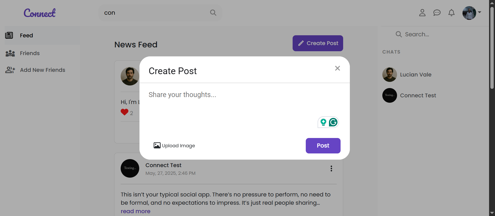

<div align="center">
  
</div>

<br/>

<div align="center">


</div>

**Connect** is a fully responsive social media web application built with Angular and Firebase. It allows users to post, love, comment, chat, send friend requests, view profiles and edit your profile — all in a seamless single-page experience.

Live Demo: [https://connect-angular-34177.web.app/app](https://connect-angular-34177.web.app/app)

You can watch a short video walkthrough of this project: [Video](https://www.linkedin.com/posts/minaanis_angular-firebase-rxjs-activity-7336486378022539264-RMsa?utm_source=share&utm_medium=member_desktop&rcm=ACoAADevjeMBJeuhzQMAKNdaoTer6bYZvAwrWwE)

---

## Features

- **Authentication** (Sign up / Login via Firebase Auth)
- **Protected Routes and form validation**
- **Create Posts** with image support (via Cloudinary)
- **Love** and **Comment** on posts
- **Send / Accept Friend Requests**
- **Chat** with friends
- **Notifications** for reactions and friend requests
- **View Profiles & Edit Your Profile**
- **“Read More”** feature for long posts
- **Global App Toast** system for errors/information (stacked display)
- Fully **Responsive** design

---

## Tech Stack

- **Frontend:** Angular v19.2.13, Angular Material, Bootstrap v5.3.6
- **State Management:**
  - **NgRx** (used in specific parts of the app)
  - **Angular Signals** and the **default Zone.js-based change detection** (used in most parts of the app)
- **Forms:** Template-driven & Reactive Forms
- **Backend:** Firebase (Authentication, Cloud Firestore, Hosting)
- **Image Storage:** Cloudinary
- **Architecture:** SPA (Single Page Application)
- **Performance:** OnPush change detection on selective components, Lazy-loaded routes
- **UX Enhancements:** Route guards, content projection, lifecycle hooks

---

## Getting Started

### 1. Clone the Repository

```bash
git clone https://github.com/MinaAnis7/connect-angular.git
cd connect
```

### 2. Install Dependencies

```bash
npm install
```

### 3. Set Up Firebase

Create a Firebase project and add your configuration to `app.config.ts`.

### 4. Run the App Locally

```bash
npm start
```

The app will run at `http://localhost:4200/`.

---

## Screenshots

<p float="left">
  
  &nbsp;
  
  
  &nbsp;
  
  
  &nbsp;
  
  
  &nbsp;
  
  
  &nbsp;
  
  
  
</p>

---

## Project Purpose

This project was built for **learning purposes** — to gain hands-on experience with Angular, Firebase, and modern web development concepts.

---

## License

This project is open for learning and experimentation. Please do not reuse the codebase as-is for production without permission.

---

## Acknowledgements

Thanks to Angular, Firebase, and Cloudinary.
